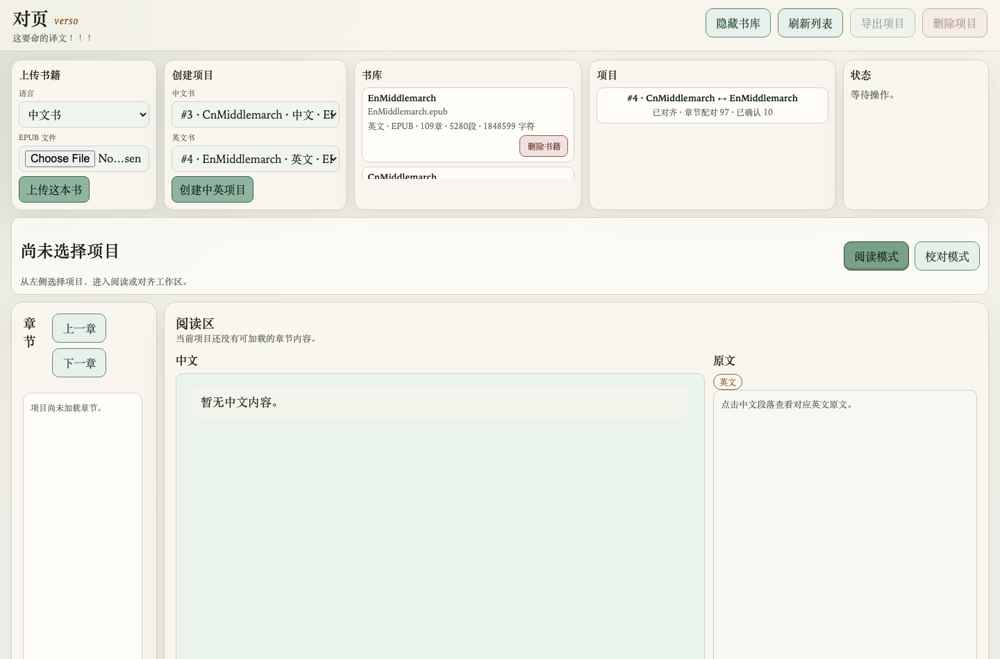
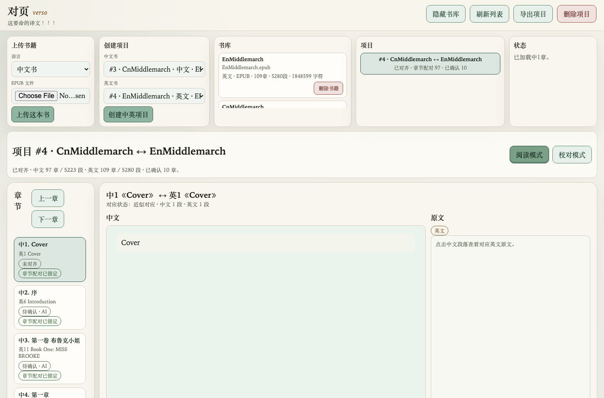
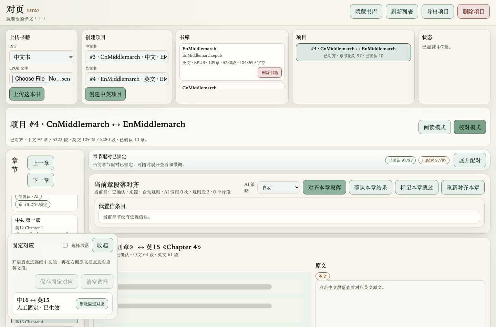
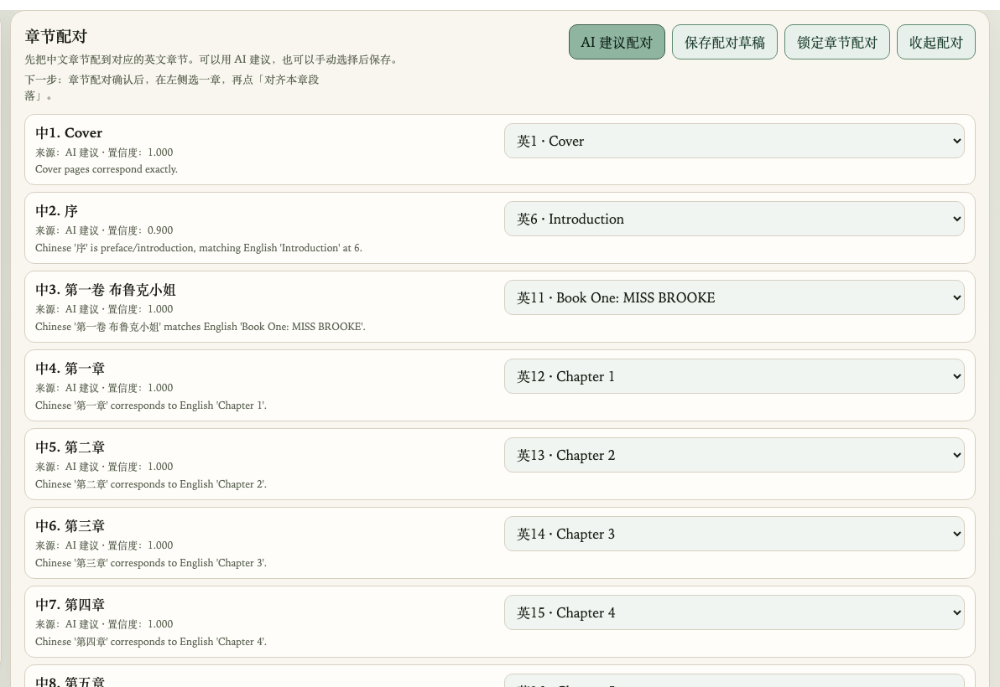
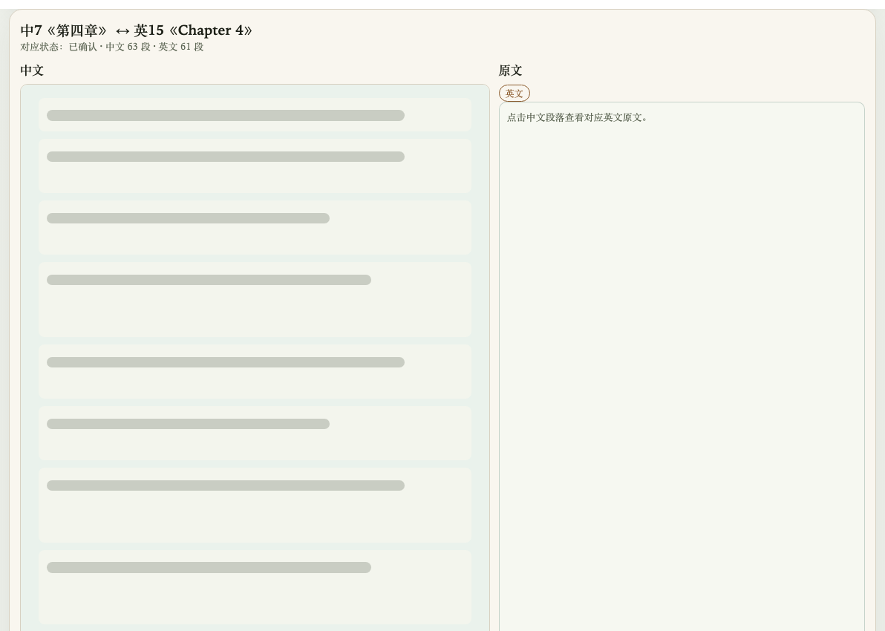
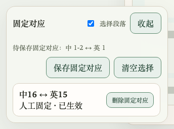
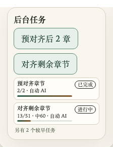
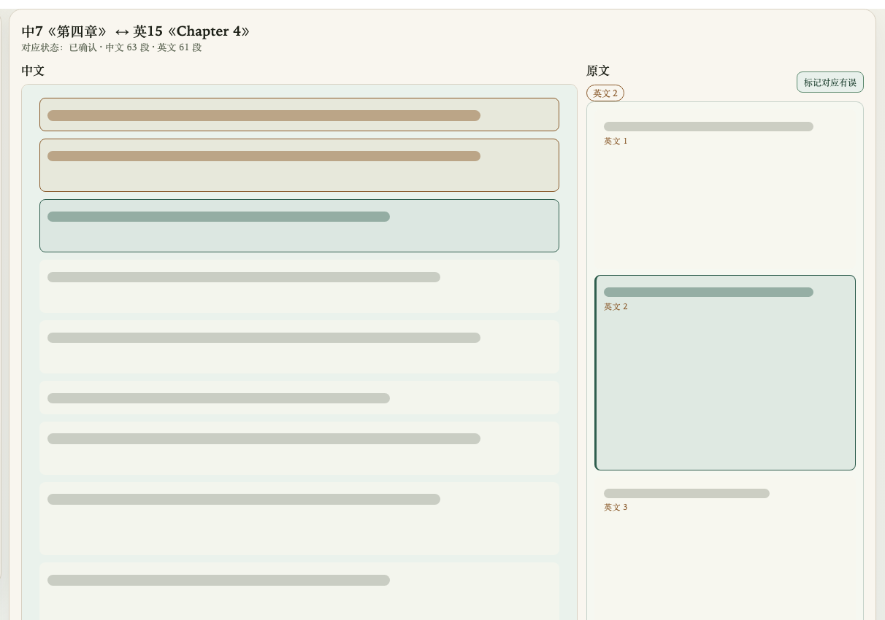

# verso 对页使用指南

这份指南给项目 owner：你会在本地 Align app 里用「校对模式」制作和修正中英对齐结果，再切回「阅读模式」检查读起来是否顺。示例使用本地 Middlemarch 项目。

> 截图来自实际本地页面。为了避免把大段书籍正文放进仓库，正文区域在部分截图中已用灰条遮挡；按钮、面板和状态保留原样。

## 1. 打开项目

先启动本地 app：

```bash
./run_web.sh
```

打开 [http://localhost:8000](http://localhost:8000)，点顶部的「书库」按钮，确认中文书和英文书已经在书库里。然后在「项目」里点击 Middlemarch 项目。



项目打开后，顶部会显示项目名、章节数和已经确认的章节数量。右上角可以在「阅读模式」和「校对模式」之间切换。



## 2. 进入校对模式

点击「校对模式」。这个模式是制作和修正对齐结果的主要工作区。

左侧是章节列表，每章会显示：

- 中文章节和对应的英文章节。
- 段落对齐状态，例如「未对齐」「待确认」「已确认」。
- 章节配对是否已经锁定。

中间上方是章节配对和当前章段落对齐工具；下方是当前章节的中文和原文区域。



## 3. 检查章节配对

章节配对决定「中文第几章」对应「英文第几章」。这是段落对齐之前最重要的一步。

推荐流程：

1. 如果还没有配对，点击「AI 建议配对」。
2. 逐行检查中文章和英文章是否对应。
3. 如果某一行不对，直接在右侧下拉框选择正确英文章节。
4. 点击「保存配对草稿」。
5. 确认整体无误后，点击「锁定章节配对」。

配对锁定后，这个面板可以收起；后续主要在左侧章节列表里选一章，再点「对齐本章段落」。



## 4. 对齐并检查当前章节

在左侧章节列表选择一章后，看「当前章段落对齐」面板。

常用按钮：

- 「对齐本章段落」：生成或更新当前章的段落对应。
- 「确认本章结果」：读过并认为当前章可以发布时使用。
- 「标记本章跳过」：当前章不适合阅读或无需展示时使用。
- 「重新对齐本章」：添加固定对应后，或觉得结果明显不对时使用。

下方阅读区会显示当前章节。左侧是中文，右侧是原文 lookup。点击中文段落后，右侧会显示系统认为对应的英文原文。



## 5. 用固定对应修正错配

如果某几段中文对应错了英文，使用「固定对应」。它会作为硬约束参与重新对齐，比普通反馈更强。

操作流程：

1. 在「校对模式」里展开左下角「固定对应」面板。
2. 勾选「选择段落」。
3. 在中文区域点击一次起始段，再点击一次结束段。
4. 在右侧原文区域点击对应英文段；如果是一段英文，就点同一段两次。
5. 点击「保存固定对应」。
6. 回到「当前章段落对齐」，点击「重新对齐本章」。

保存后，固定对应会出现在面板列表里。重新对齐时，系统会保留这些人工指定关系，只重算其他空白区间。



## 6. 批量处理后续章节

当前章确认后，可以继续下一章；如果前面流程已经跑顺，可以用后台任务加快。

后台任务区有两个常用按钮：

- 「预对齐后 2 章」：适合先小范围试跑，确认策略没问题。
- 「对齐剩余章节」：适合章节配对已经稳定后批量处理。

后台任务列表会显示进度和较早任务摘要。任务运行时可以继续查看已完成章节。



## 7. 切回阅读模式检查阅读效果

当一章已经对齐，点击右上角「阅读模式」。

阅读模式的目标不是编辑，而是模拟最终读者体验：

1. 在左侧选择一章。
2. 主要阅读中文。
3. 遇到拿不准的译文，点击对应中文段落。
4. 右侧会显示对应英文原文和少量上下文。
5. 如果发现对应关系不准，点「标记对应有误」，或者回到「校对模式」添加固定对应并重新对齐。



## 什么时候确认，什么时候继续修

可以点击「确认本章结果」：

- 章节配对正确。
- 多数段落点击后能看到合理的英文对应。
- 关键段落没有明显错位。
- 固定对应修正过的问题已经重新对齐并检查过。

应该继续修：

- 中文章节明显配错英文章节。
- 点击中文段落时，右侧英文经常跳到不相关内容。
- 一段中文需要对应多段英文，或多段中文需要对应一段英文，但系统没有处理好。
- 关键段落影响阅读理解。

只用阅读模式即可：

- 只是想检查读起来是否顺。
- 偶尔查一下英文，不需要修改对齐结果。
- 已确认章节需要做最终发布前的人工抽查。

## 最短工作流

1. 打开项目。
2. 进入「校对模式」。
3. 检查并锁定章节配对。
4. 选一章，点击「对齐本章段落」。
5. 点击中文段落检查英文 lookup。
6. 错位时添加「固定对应」，再「重新对齐本章」。
7. 满意后「确认本章结果」。
8. 切回「阅读模式」再读一遍。
